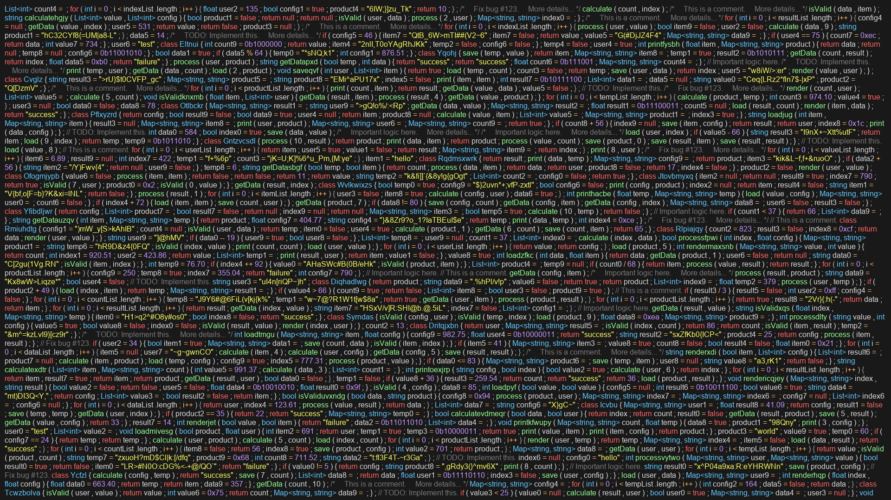

# Fake Code Image Generator

This Python script generates a "wall of text" resembling C-like programming languages, complete with data types, curly braces, semicolons, and basic syntax highlighting. It's designed to create visually dense code snippets, ideal for use as background images or banners.

## Features

- Generates random code statements including declarations, assignments, function calls, method definitions, class definitions, conditionals, and loops.
- Mimics C-like syntax with semicolons and curly braces.
- Includes basic syntax highlighting for better visual distinction.
- Can output directly to the terminal or generate an image file with specified resolution.

## How to Use

1.  **Install the package:**

    ```bash
    python -m venv venv
    # On Windows:
    .\venv\Scripts\activate.bat
    # On macOS/Linux:
    source venv/bin/activate
    pip install -e .
    pip install -r requirements.txt
    ```

2.  **Generate an image file:** To create an image file (e.g., `fake_code_banner.png`) with the fake code, use the `generate_fake_code_image` command and specify the desired width, height, and optionally the output filename:

    ```bash
    generate_fake_code_image --width 1920 --height 1080 --statements 500 --output fake_code_banner.png
    ```

    You can adjust `--width`, `--height`, `--statements`, and `--output` to control the image dimensions, the amount of code generated, and the output filename.

## Example Output (Image)

A `fake_code_banner.png` file will be generated in the same directory where you run the script.



---

_This code was generated by an AI assistant._